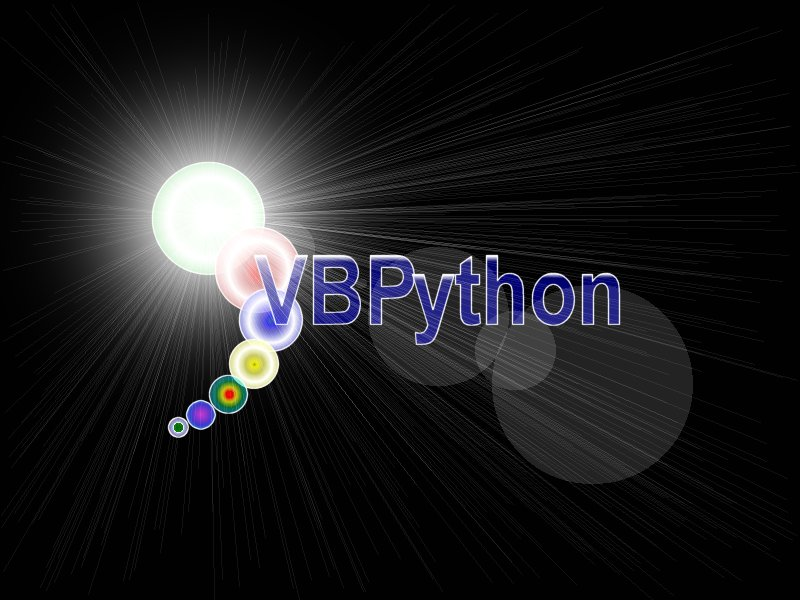



## AAA\_VBPython 1\.08e UPDATE\!\!\!\!

### Description

VBPython 1.08e: enhanced 4-player snakes game with power-ups. Not the same and usual "SNAKE". It's a different one. check it.

features (* new in this version)

- logic game engine, easily expansible

- up to 4 players

- many power-ups, making the match less boring

- play with maps (mazes) or without

- customizable options

-*Map Editor

-*Improved map management

-*"Spheric" map: exit on a side and enter on the opposite one

-*bugfixes

sorry, but I have included only one map, but you can enjoy creating your ones with the map editor.

play, learn, and VOTE & leave COMMENTS!! :)

thanks
 
### More Info
 

             |
---                |---
**Submitted On**   |2002-09-19 18:14:04
**By**             |[Enrico Bertozzi](https://github.com/Planet-Source-Code/PSCIndex/blob/master/ByAuthor/enrico-bertozzi.md)
**Level**          |Intermediate
**User Rating**    |5.0 (20 globes from 4 users)
**Compatibility**  |VB 5\.0, VB 6\.0
**Category**       |[Games](https://github.com/Planet-Source-Code/PSCIndex/blob/master/ByCategory/games__1-38.md)
**World**          |[Visual Basic](https://github.com/Planet-Source-Code/PSCIndex/blob/master/ByWorld/visual-basic.md)
**Archive File**   |[AAA\_VBPyth1338359202002\.zip](https://github.com/Planet-Source-Code/enrico-bertozzi-aaa-vbpython-1-08e-update__1-39145/archive/master.zip)

